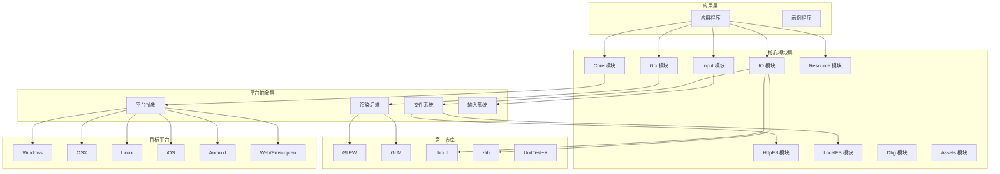
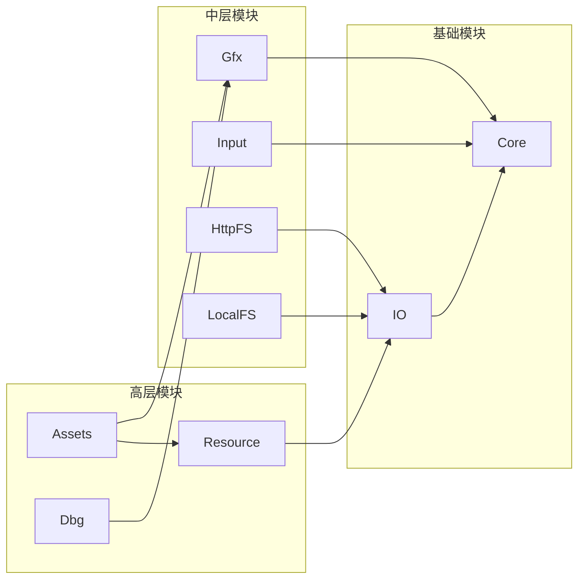
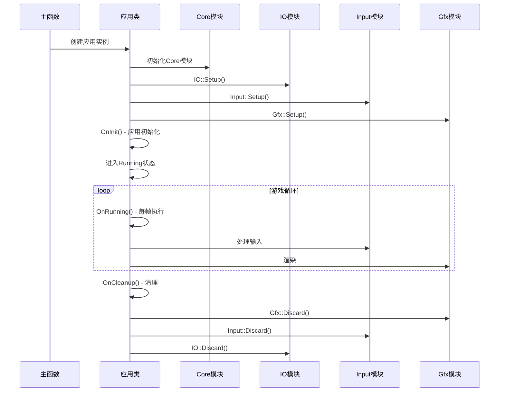
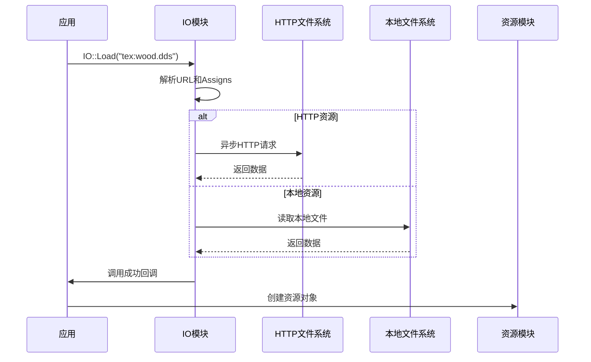
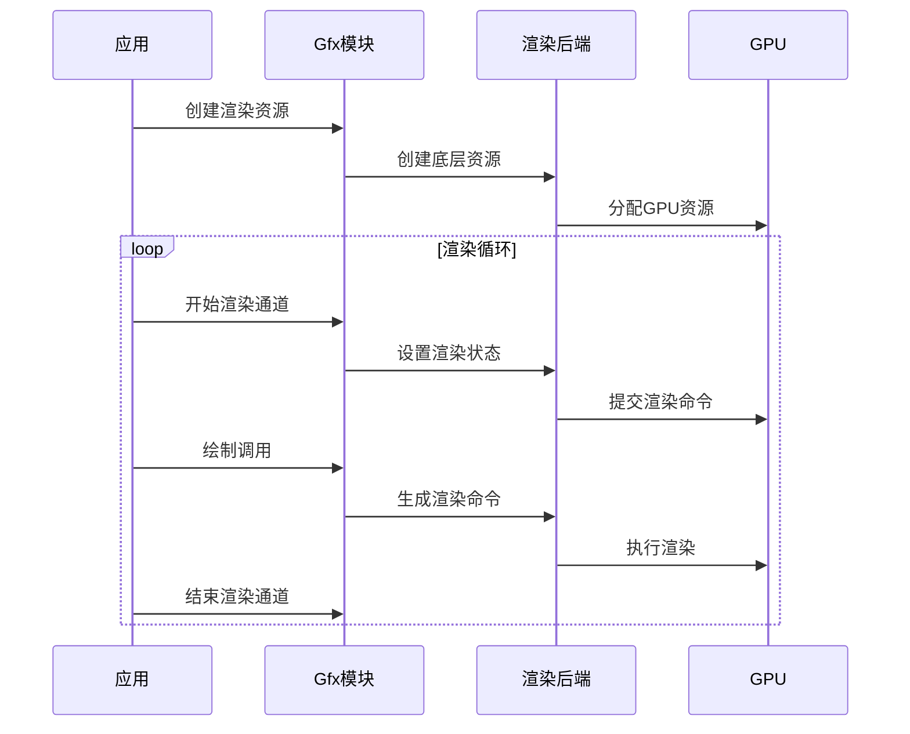

# Oryol 项目架构分析

## 项目概述

Oryol 是一个轻量级、可移植、可扩展的 C++11 3D 编程框架，专注于移动和 Web 平台。它采用模块化设计，提供跨平台的图形渲染、输入处理、资源管理等功能。

### 核心设计理念

- **轻量化**: 生成小型可执行文件（WebGL 演示从约 100KB 开始）
- **实验性**: 支持激进的设计理念和快速迭代
- **跨平台**: 支持 OSX、Linux、Windows、iOS、Android、Emscripten
- **C++11**: 谨慎选择 C++ 特性，避免异常、代码膨胀和过度动态内存分配

## 整体架构图



## 模块依赖关系



## 核心模块详解

### 1. Core 模块 - 基础服务

**功能职责:**
- 统一的应用模型（跨平台应用生命周期管理）
- 文本日志系统
- 时间测量
- 内存管理
- 容器类（替代 STL）
- 字符串处理
- 断言系统

**关键类:**
- `App`: 应用基类，实现状态机模式
- `Log`: 中央日志系统
- `Clock`, `TimePoint`, `Duration`: 时间测量
- `Array`, `ArrayMap`, `Buffer`: 自定义容器

**应用状态模型:**
```cpp
enum class AppState {
    Invalid,
    Init,           // 初始化状态
    Running,        // 运行状态
    Cleanup         // 清理状态
};
```

### 2. IO 模块 - 异步资源加载

**设计哲学:**
- 专注于异步数据加载
- 使用 URL 而非文件路径
- 可插拔的文件系统实现
- 基于 HTTP 设计蓝图

**核心概念:**
- **Assigns（路径别名）**: 简化文件路径管理
- **URL**: 统一资源定位符
- **可插拔文件系统**: 支持不同数据源

**支持的文件系统:**
- HTTPFileSystem: 从 Web 服务器加载
- LocalFileSystem: 从本地文件系统加载

### 3. Gfx 模块 - 图形渲染

**渲染后端支持:**
| 平台 | GL3.3 | GLES3 | Metal | D3D11 |
|------|-------|-------|-------|-------|
| OSX 10.11+ | ✓ | - | ✓ | - |
| iOS 9.x+ | - | ✓ | ✓ | - |
| Windows 7+ | ✓ | - | - | ✓ |
| Linux | ✓ | - | - | - |
| Android | - | ✓ | - | - |
| HTML5 | - | ✓ | - | - |
| RaspberryPi | - | ✓ | - | - |

**核心资源类型:**
- Meshes（网格）
- Textures（纹理）
- Shaders（着色器）
- Pipelines（管线）
- Render Passes（渲染通道）

### 4. Input 模块 - 输入处理

**支持的输入类型:**
| 平台 | 键盘 | 鼠标 | 游戏手柄 | 触摸 | 传感器 |
|------|------|------|----------|------|--------|
| OSX | ✓ | ✓ | ✓* | - | - |
| Linux | ✓ | ✓ | ✓ | - | - |
| Windows | ✓ | ✓ | ✓* | - | - |
| iOS | - | - | - | ✓ | ✓ |
| Android | - | - | - | ✓ | ✓ |
| HTML5 (桌面) | ✓ | ✓ | ✓ | - | - |
| HTML5 (移动) | - | - | - | ✓ | ✓ |
| RaspberryPi | ✓ | ✓ | - | - | - |

**输入处理方式:**
- **轮询模式**: 检查特定键/按钮状态
- **事件回调**: 处理所有输入事件

## 工作流程

### 1. 应用启动流程



### 2. 资源加载流程



### 3. 渲染流程



## 技术原理

### 1. 跨平台抽象

**平台抽象策略:**
- 使用条件编译处理平台差异
- 提供统一的 API 接口
- 底层实现针对特定平台优化

**关键抽象层:**
- 窗口管理（GLFW 或原生 API）
- 图形 API（OpenGL、Metal、D3D11）
- 文件系统（POSIX、Windows API）
- 输入系统（平台特定输入 API）

### 2. 内存管理

**设计原则:**
- 避免过度动态内存分配
- 使用自定义容器替代 STL
- 支持内存池和对象池
- 静态链接减少运行时依赖

**内存策略:**
- 栈分配优先
- 对象生命周期管理
- 避免异常处理开销

### 3. 异步处理

**IO 异步模型:**
- 基于回调的异步加载
- 多线程 IO 处理
- 支持批量加载
- 错误处理和重试机制

**渲染异步:**
- 命令缓冲区模式
- GPU 和 CPU 并行处理
- 资源上传队列

### 4. 模块化设计

**模块特点:**
- 静态链接库
- 清晰的依赖层次
- 可插拔架构
- 最小化耦合

**扩展机制:**
- 外部代码模块
- 自定义文件系统
- 自定义渲染后端
- 插件式架构

## 构建系统

### Fips 构建工具

**特点:**
- Python 驱动的 CMake 前端
- 支持多平台构建
- IDE 集成支持
- 自动化依赖管理

**构建配置:**
- 支持多种编译器（MSVC、GCC、Clang）
- 跨平台编译支持
- 调试和发布配置
- 平台特定优化

## 性能优化

### 1. 代码大小优化

**策略:**
- 静态链接所有依赖
- 避免不必要的 C++ 特性
- 条件编译移除未使用代码
- 优化 Emscripten 输出

### 2. 运行时性能

**优化技术:**
- 对象池和内存池
- 批量渲染
- 异步资源加载
- GPU 命令优化

### 3. 内存效率

**内存管理:**
- 避免动态分配
- 使用栈分配
- 对象生命周期控制
- 内存对齐优化

## 总结

Oryol 是一个设计精良的轻量级游戏引擎框架，其架构体现了以下核心价值：

1. **模块化设计**: 清晰的模块层次和依赖关系
2. **跨平台兼容**: 统一的 API 抽象多平台差异
3. **性能优先**: 轻量化设计，最小化运行时开销
4. **可扩展性**: 插件式架构支持功能扩展
5. **开发友好**: 简洁的 API 设计和良好的工具支持

这个架构为开发者提供了一个稳定、高效、可扩展的 3D 图形开发基础，特别适合需要跨平台部署的轻量级应用和游戏项目。 